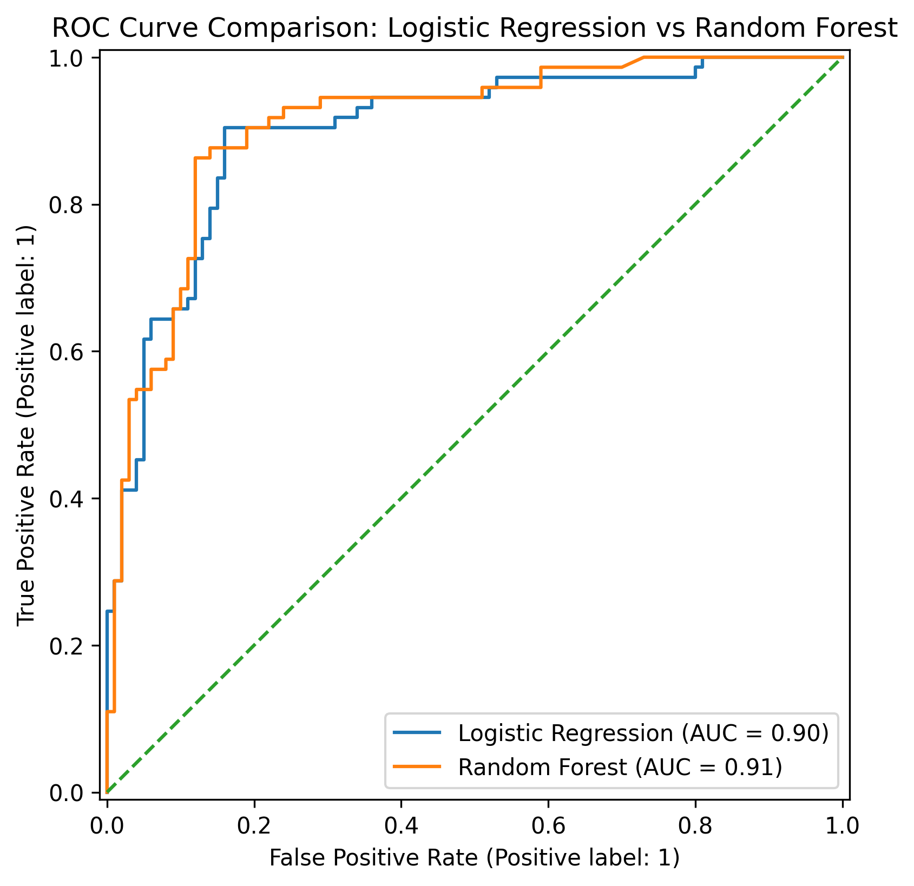
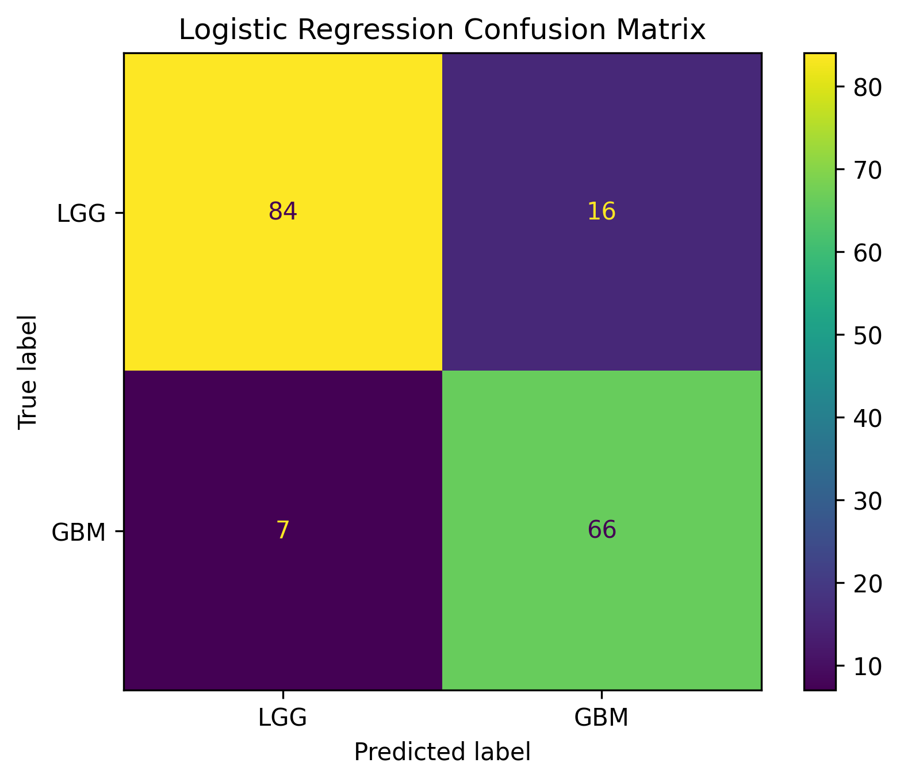
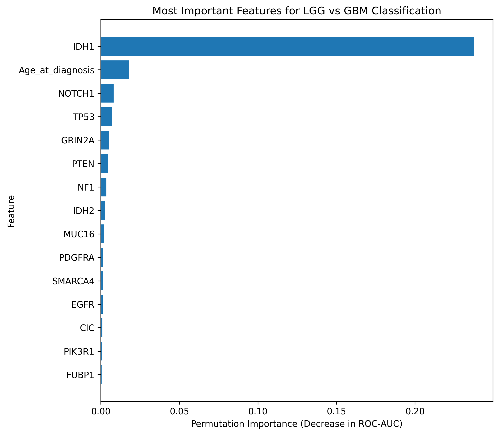

# Machine Learning Classification of Glioma
## Notebook

[View the complete analysis notebook](Glioma_ML_Project_Clean_Portfolio.ipynb)
## Overview

This project explores whether clinical characteristics and genetic mutation features can be used to distinguish lower-grade glioma (LGG) from glioblastoma (GBM) using supervised machine learning.

The analysis uses a public glioma dataset derived from TCGA and available through the UCI Machine Learning Repository.

Two classification models were compared:

- Logistic Regression
- Random Forest

The project focuses on model performance, validation, interpretability, and limitations rather than clinical deployment.
## Key Results

- **Logistic Regression:** 86.7% test accuracy, ROC-AUC 0.900
- **Random Forest:** ROC-AUC 0.909
- **10-fold cross-validation ROC-AUC:** ~0.93 for both models
- **Strongest predictive feature:** IDH1 mutation status

## **Dataset:** [UCI Glioma Grading Clinical and Mutation Features](https://archive.ics.uci.edu/dataset/759/glioma+grading+clinical+and+mutation+features+dataset)

The analysis uses the Glioma Grading Clinical and Mutation Features dataset from the UCI Machine Learning Repository.

The raw dataset used in this analysis contained 862 records and included:

- Age at diagnosis
- Gender
- Genetic mutation status
- LGG / GBM grade labels

Genes included in the dataset include IDH1, TP53, ATRX, PTEN, EGFR, NOTCH1, IDH2, NF1, and others.

## Methods

The workflow included:

1. Data inspection and cleaning
2. Missing-value handling
3. Removal of potential data-leakage variables
4. Conversion of age into a numerical feature
5. 80/20 stratified train-test split
6. Numerical scaling and categorical encoding
7. Logistic Regression training
8. Random Forest training
9. 10-fold stratified cross-validation
10. ROC-AUC, accuracy, and balanced-accuracy evaluation
11. Permutation feature-importance analysis

## Results

| Model | Test Accuracy | Balanced Accuracy | Test ROC-AUC | Mean CV ROC-AUC |
|---|---:|---:|---:|---:|
| Logistic Regression | 86.7% | 87.2% | 0.900 | 0.930 |
| Random Forest | 84.4% | 84.8% | 0.909 | 0.929 |
## Visual Results

### ROC Curve Comparison

### Logistic Regression Confusion Matrix

### Feature Importance

Both models showed strong discrimination between LGG and GBM.

Random Forest achieved a slightly higher held-out ROC-AUC, while Logistic Regression achieved higher accuracy and balanced accuracy. Cross-validation ROC-AUC was nearly identical between the two approaches.

The more complex Random Forest therefore did not show a substantial overall advantage over Logistic Regression.

## Feature Importance

Permutation feature-importance analysis identified **IDH1 mutation status** as the strongest individual predictive feature in the Logistic Regression model.

IDH1 permutation importance was approximately **0.238**, substantially higher than the next-ranked features.

Feature importance represents predictive association within this dataset and should not be interpreted as biological causation.

## Key Lessons

This project helped me understand that biomedical machine learning involves more than simply training an algorithm.

Important considerations included:

- data cleaning
- detecting data leakage
- train/test separation
- cross-validation
- choosing appropriate evaluation metrics
- comparing model complexity
- interpreting feature importance cautiously
- distinguishing predictive association from causation

## Limitations

This project is an educational retrospective proof-of-concept.

It is not a clinically validated diagnostic model.

Limitations include:

- use of a single public dataset
- no independent external validation cohort
- simplified binary LGG-versus-GBM classification
- dataset-specific model performance
- feature importance does not establish biological causality

## Tools

- Python
- pandas
- NumPy
- scikit-learn
- matplotlib
- Google Colab

## References

Tasci, E., Camphausen, K., Krauze, A. V., & Zhuge, Y. (2022). *Glioma Grading Clinical and Mutation Features* [Dataset]. UCI Machine Learning Repository. https://doi.org/10.24432/C5R62J

Tasci, E., Zhuge, Y., Kaur, H., Camphausen, K., & Krauze, A. V. (2022). Hierarchical voting-based feature selection and ensemble learning model scheme for glioma grading with clinical and molecular characteristics. *International Journal of Molecular Sciences, 23*(22), 14155.

Pedregosa, F., Varoquaux, G., Gramfort, A., Michel, V., Thirion, B., Grisel, O., et al. (2011). Scikit-learn: Machine learning in Python. *Journal of Machine Learning Research, 12*, 2825–2830.

## Development Note

This was completed as my first hands-on machine-learning project with AI-assisted coding and troubleshooting.

I worked through the public dataset, executed the analysis, reviewed and interpreted the outputs, and studied the methodology and limitations step by step.

The numerical model results shown here were generated by this analysis and were not copied from the associated publication.
